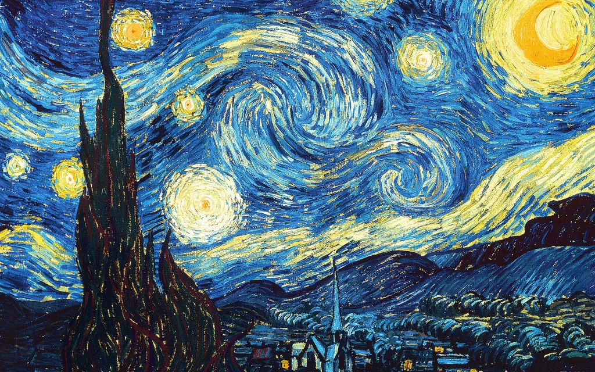
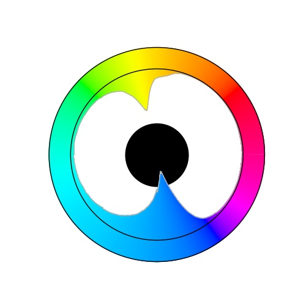
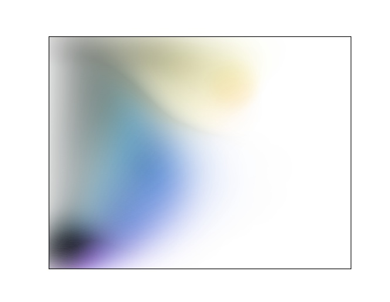

# visualize Hue and Tone Distribution

画像の色相と色調（明度，彩度）の分布を画像として出力するプロクラム．  
色相，明度，彩度はL<sup>\*</sup>a<sup>\*</sup>b<sup>\*</sup>色空間においてのものを使用．  
L<sup>\*</sup>a<sup>\*</sup>b<sup>\*</sup>における色相環の表示や，分布の均しについては工夫してある．  
コード説明は今の所，特にしない．

実行は以下．(filename)\_H.jpg，(filename)\_VC.jpgが作成される．
```
python distribution.py (image file)
```

# example

## 1
### origin

### Hue distribution

### Tone distribution


## 2
### origin

### Hue distribution

### Tone distribution

